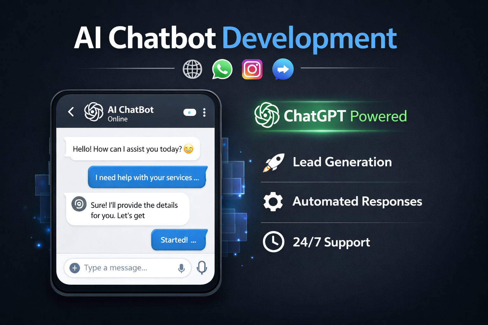
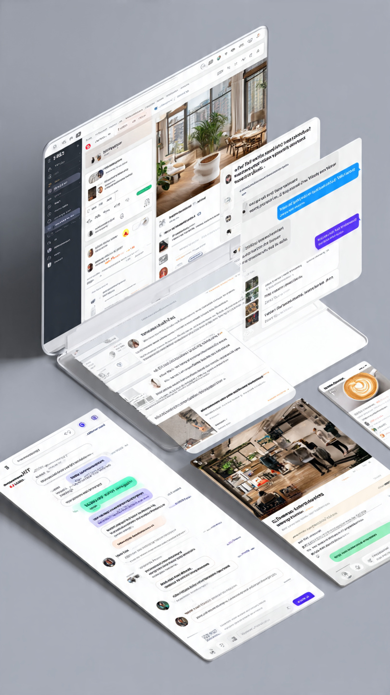
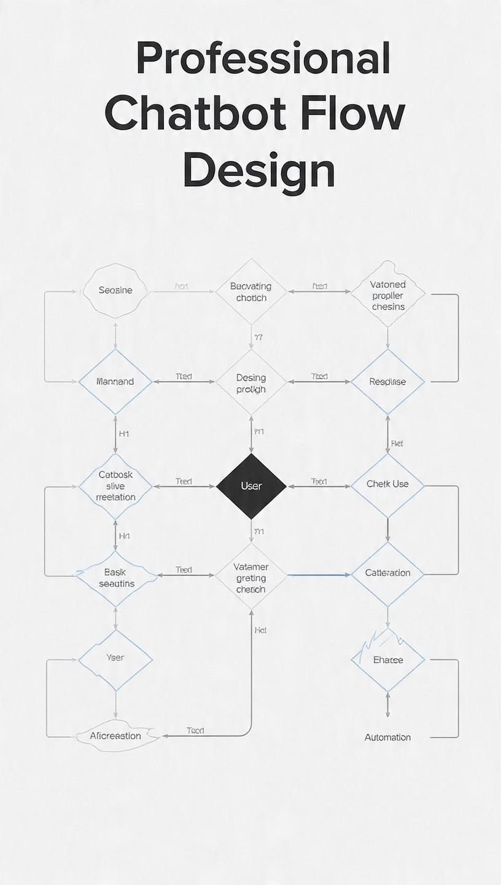
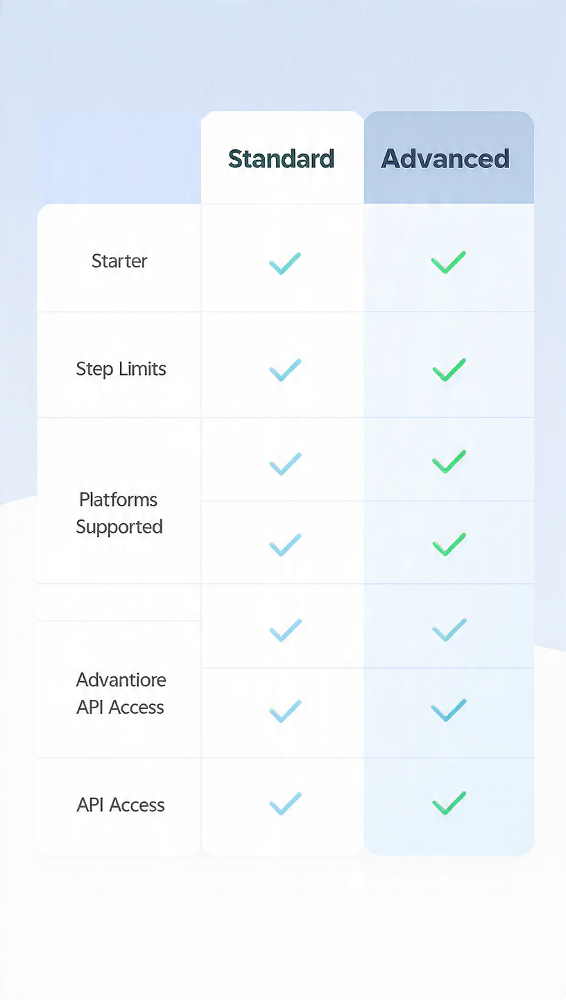

<p align="center">
  
</p>

# WhatsApp AI Bot (Small Business)

Minimal WhatsApp Cloud API webhook that auto-replies with OpenAI.

## What You Get
- `GET /webhook` verification (Meta subscribe)
- `POST /webhook` message receive + AI reply
- Optional request signature verification via `META_APP_SECRET`

## Prereqs
- Node.js 18+
- Meta WhatsApp Cloud API app + webhook subscription
- A public HTTPS URL for the webhook (during dev: use ngrok/cloudflared)

## Setup
1. Create env file:

```sh
cp .env.example .env
```

2. Fill `.env`:
- `WHATSAPP_VERIFY_TOKEN`: any string (must match Meta webhook config)
- `META_APP_SECRET`: from Meta app settings (recommended; can be blank to skip signature check)
- `WHATSAPP_PHONE_NUMBER_ID` + `WHATSAPP_ACCESS_TOKEN`
- `OPENAI_API_KEY`

3. Install deps and run:

```sh
npm install
npm run start
```

Health check:

```sh
curl http://localhost:3000/health
```

## Meta Webhook Configuration
- Callback URL: `https://YOUR_DOMAIN/webhook`
- Verify token: value of `WHATSAPP_VERIFY_TOKEN`

Subscribe to WhatsApp events (messages). When a user messages your business number, Meta will POST to `/webhook`.

## Notes
- This is a simple starter. For production you should add:
  - persistent dedup storage (Redis)
  - rate limiting
  - conversation context per customer
  - message template handling + opt-in flows

## Final Images
<p>
  
  
  
  
</p>


